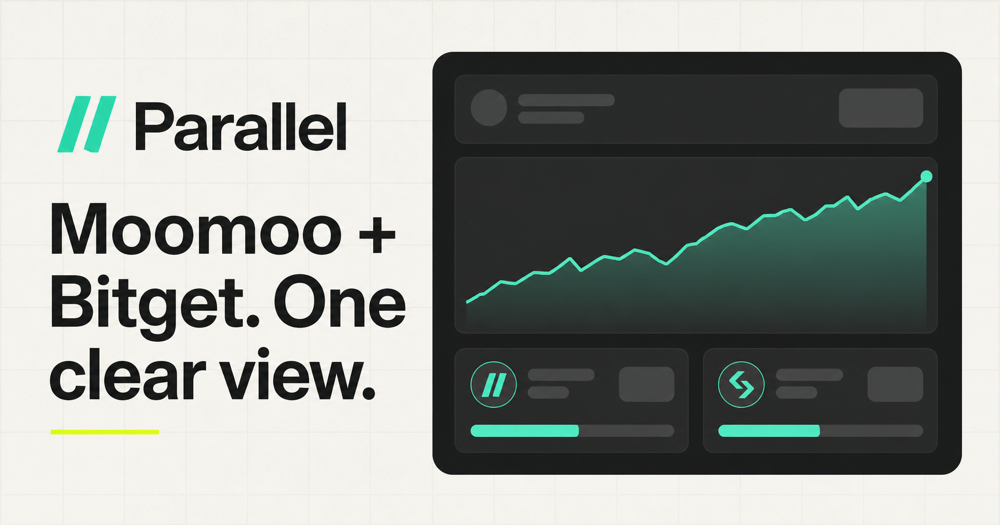

# Parallel

Parallel is a private, read-only portfolio dashboard that combines Moomoo and Bitget holdings in one view.



## Features

- Unified portfolio value and allocation
- Moomoo positions through the local OpenD gateway
- Bitget Unified Trading Account support with a Classic spot fallback
- Platform and holding filters
- Balance privacy controls
- Demo data when no account is connected
- No order, transfer, or withdrawal code

## Requirements

- Node.js 22.13 or newer
- Python 3.8 or newer for the Moomoo bridge
- Moomoo OpenD for Moomoo account access
- A read-only Bitget API key for Bitget account access

## Local setup

Install the dashboard dependencies:

```bash
npm install
cp .env.example .env.local
```

Add only read-only Bitget credentials to `.env.local`. Never commit that file.

```text
BITGET_API_KEY=
BITGET_SECRET_KEY=
BITGET_PASSPHRASE=
```

Start the dashboard:

```bash
npm run dev
```

Open [http://localhost:3000](http://localhost:3000).

## Connect Moomoo

1. Download and run Moomoo OpenD.
2. Log in and keep OpenD bound to `127.0.0.1:11111`.
3. Install the bridge in an isolated Python environment:

```bash
python3 -m venv .venv
.venv/bin/pip install -r bridge/requirements.txt
.venv/bin/python bridge/moomoo_bridge.py
```

4. Add this to `.env.local`:

```text
MOOMOO_BRIDGE_URL=http://127.0.0.1:8788
```

The bridge can run without a token only when it is bound to localhost. Set `MOOMOO_BRIDGE_TOKEN` before exposing it to any other interface. Never expose OpenD directly to the public internet.

See [INTEGRATION.md](INTEGRATION.md) for the connector contract and hosted setup notes.

## Security

- Use read-only API permissions.
- Do not enable trade, transfer, or withdrawal access.
- Keep `.env.local` private.
- Bind API keys to trusted IP addresses when practical.
- Rotate a key immediately if it appears in chat, a screenshot, logs, or Git history.

## Validation

```bash
npm run build
```
